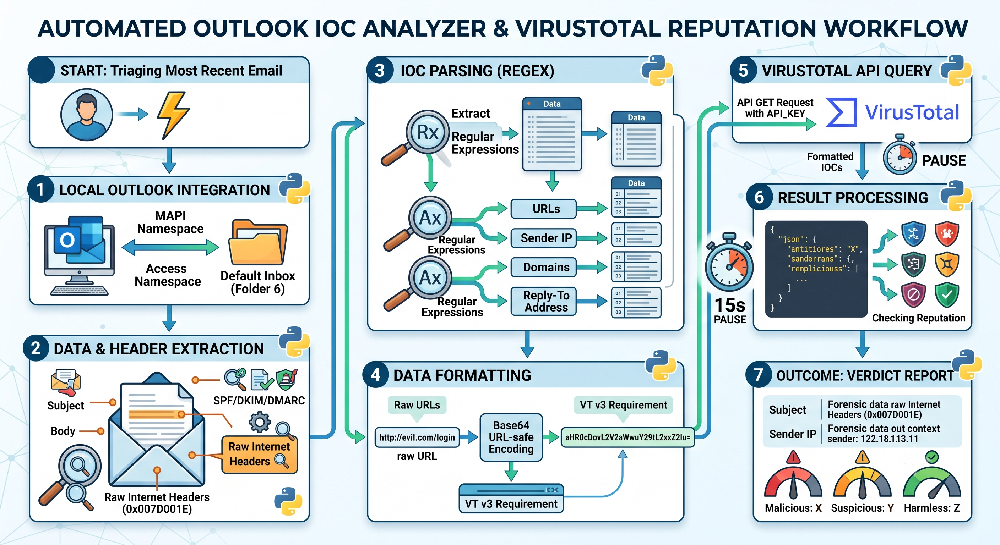

# PhishingEmailAnalyser
An automated Python tool designed for rapid security triage. It interfaces directly with the local Microsoft Outlook desktop application to analyze recent emails, extract hidden transport headers (SPF, DKIM, DMARC), pull embedded URLs and IP addresses, and automatically check all Indicators of Compromise (IOCs) against the VirusTotal v3 API.

# Features

1) **Local Outlook Integration:** Connects seamlessly to the local MAPI namespace of an active Windows Outlook session.
2) **Deep Header Extraction:** Bypasses standard object properties to extract raw transport headers for accurate sender and IP identification.
3) **Authentication Validation:** Parses SPF, DKIM, and DMARC results directly from the headers.
4) **Automated IOC Parsing:** Uses regular expressions to identify and extract URLs, domains, and IP addresses from the email body and headers.
5) **VirusTotal v3 API Integration:** Automatically formats and submits extracted IOCs to VirusTotal, returning a clean readout of Malicious, Suspicious, and Harmless scores.
6) **Smart Rate Limiting:** Built-in delays ensure compliance with the free-tier VirusTotal API request limits (4 lookups/minute).

# How it Works

1. **Tapping into Outlook**

-> Instead of connecting to an email server via IMAP or Exchange, the script talks directly to the Outlook application running on your Windows computer.

-> It uses win32com.client.Dispatch to hook into the MAPI (Messaging Application Programming Interface). This allows Python to click through Outlook programmatically.

-> It asks for Folder(6), which is Microsoft's internal numeric code for the primary Inbox.

-> It grabs all the emails, sorts them by ReceivedTime so the newest is at the top, and uses a counter in the main() loop to stop after reading just the first (most recent) email.

2. **Extracting Hidden Forensic Data**

-> An email contains much more data than just the Subject and Body. It contains hidden "Transport Headers" that show the exact path the email took and the security checks it passed.

-> Standard properties like message.Subject and message.Body are pulled directly.

-> To get the hidden headers, the script queries a specific internal Microsoft registry tag: 0x007D001E. This pulls the raw, unformatted text block of the email headers.

-> Once it has this block of text, the script uses Regular Expressions (Regex)—pattern-matching rules—to slice out specific data:

-> It looks for X-Sender-IP: to find the true origin IP.

-> It pulls the Reply-To: address.

-> It checks for authentication protocols like spf, dkim, and dmarc results.

-> It scans the entire message.Body looking for anything that starts with http:// or https:// to build a list of all clicked links.

3. **Formatting the Data for VirusTotal**

-> Once the script has a list of Indicators of Compromise (IOCs)—the URLs, IPs, and Domains—it passes them to the reputation_check() function. This function prepares the data for the VirusTotal v3 API.

-> IPs and domains are straightforward, but URLs require special handling. VirusTotal's API cannot accept a raw URL (like [hxxps[://]evil[.]com/login](hxxps[://]evil[.]com/login)) directly in the request path because the slashes and characters break the web request.
s
-> To solve this, the script translates the URL into URL-safe Base64 encoding. It converts the text into a safe string of random-looking characters and strips away the = padding at the end.

4. **Getting the Verdict**
   
-> With the data formatted, the script reaches out to VirusTotal:

-> It uses the requests library to send an HTTP GET request, attaching your API_KEY to prove you are authorized.

-> VirusTotal sends back a large JSON file (a structured data dictionary) containing the results of over 70 different antivirus engines.

-> The script drills down into that JSON file specifically targeting ['data']['attributes']['last_analysis_stats'] to pull out three simple numbers: how many engines found it Malicious, Suspicious, or Harmless.

-> Finally, it hits time.sleep(15). Because VirusTotal's free tier only allows 4 requests per minute, pausing for 15 seconds after every single check ensures the script doesn't get temporarily banned for spamming the API.

